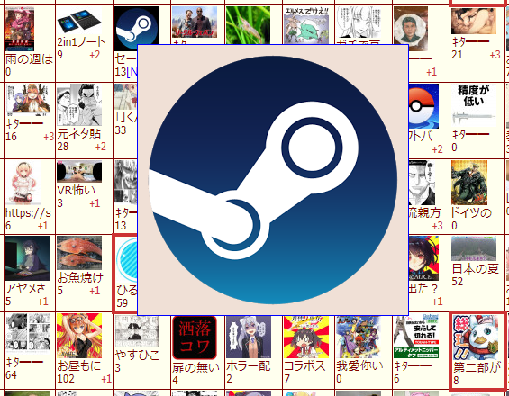
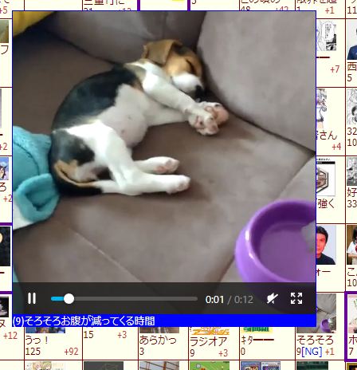
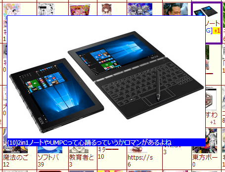

##  KOSHIAN カタログの画像をポップアップで表示 改

このFirefoxアドオンはふたば☆ちゃんねるのカタログのスレ画像をポップアップ表示する[Pachira](https://addons.mozilla.org/ja/firefox/user/anonymous-a0bba9187b568f98732d22d51c5955a6/)氏の[KOSHIAN カタログの画像をポップアップで表示](https://addons.mozilla.org/ja/firefox/addon/koshian-image-popuper/)の非公式改変版です。  
ポップアップにスレ本文を表示する機能やポップアップをクリックしてスレを開く機能などをオリジナル版に追加しています。  

※このアドオンはWebExtensionアドオン対応のFirefox専用となります。  
※他のKOSHIAN改変版などのふたば閲覧支援ツールは[こちら](https://github.com/akoya-tomo/futaba_auto_reloader_K/wiki/)。  

## 機能
* オリジナルの機能（KOSHIAN カタログの画像をポップアップで表示）
  - ふたば☆ちゃんねるのカタログのスレ画像をポップアップ表示   
    ポップアップの最大サイズはカスタマイズできます。（デフォルト：400px × 400px）  
      
    　  
    動画もポップアップ上で再生できます。  
      
* 追加・修正された機能（KOSHIAN カタログの画像をポップアップで表示 改）
  - ポップアップにスレ本文を表示する（デフォルト：無効）  
    ポップアップ画像の下にスレ本文とレス数が表示されます。  
    スレ本文の最大表示行数と行の高さを設定することができます。  
      
    サムネ使用時はスレ本文の表示文字数はカタログ設定文字数となります。  
  - ポップアップのリンクを有効にする（デフォルト：無効）  
    ポップアップをクリックしてスレを開くことができます。  
    WebM・mp4は「動画のコントロールを表示」オプションが無効のときのみリンクが有効になります。  
  - ポップアップにスレ画像のサムネを使用する（デフォルト：無効）  
    ポップアップにスレ画像のサムネを使用します。サムネはファイルサイズが小さいのでポップアップの読み込みが遅いときに効果を期待できます。WebM・mp4はサムネが表示されポップアップ上では動画再生できません。  
    無効にするとオリジナルサイズのスレ画像を使用します。  
  - スレ画像の読み込みエラーのときにエラー画像をポップアップ表示  
    ポップアップ画像を読み込むときに画像削除やスレ消滅などで読み込めなかったときはエラー画像が表示されます。  
    　　　   
    左から「スレ画像削除」「スレ消滅」「読込エラー」「読込タイムアウト」のエラー画像です。  
    サムネ使用時はエラーの種類に関わらず「スレ画像削除」のエラー画像が表示されます。  
  - 過剰なリクエストの抑制  
    サーバーへの過剰なリクエストを抑制しました。デメリットとしてポップアップまでの時間の最小値が300ミリ秒に制限されます。表示の遅れが気になるときはサムネ使用をご検討下さい。  
  - [KOSHIAN リロード拡張 改](https://github.com/akoya-tomo/koshian_reload_futaba_kai/)のページ更新無しでのカタログリロードに対応  
  -  ポップアップ拡大縮小のアニメーション時間（デフォルト：0ms = アニメーション無効）  
    ポップアップを表示や隠すときの拡大縮小のアニメーション時間を設定できます。

## インストール
**GitHub**  
  

※「接続エラーのため、アドオンをダウンロードできませんでした。」と表示されてインストール出来ない時は、インストールボタンを右クリックしてxpiファイルをダウンロードし、メニューのツール→アドオン（またはCtrl+Shift+A）で表示されたアドオンマネージャーのページにxpiファイルをドラッグ＆ドロップして下さい。  

## 追加機能の補足
* スレ本文が最大表示行数を超過する場合は省略されます。  
* ポップアップが画面上下端と接触しているとスレ本文が最大表示行数まで表示されないことがあります。  
* スレ本文表示時は文字数確保のため、ポップアップの最小横幅が100pxになります。

## 注意事項
* 本アドオンを有効にしたときはオリジナル版を無効にするか削除して下さい。  
* オリジナル版とは別アドオンなので設定は初期値に戻ります。  
  再度設定をお願い致します。  
* [futaba catalog NG](https://greasyfork.org/ja/scripts/37565-futaba-catalog-ng/)を使用する場合は必ずfutaba catalog NG **v1.2.6以上**をインストールして下さい。
* [futaba thread highlighter K](https://greasyfork.org/ja/scripts/36639-futaba-thread-highlighter-k/)がピックアップしたスレの画像もポップアップさせたい場合はfutaba thread highlighter K **rev13以上**をインストールして下さい。

## 更新履歴
* v1.9.2 2020-03-09
  - 縮小中のポップアップにマウスカーソルを移動したときに開く動作をしないように修正
  - ポップアップからサムネにマウスカーソルを移動したときに閉じる動作をしないように修正
* v1.9.0 2020-02-27
  - ポップアップ拡大縮小のアニメーションを追加
* v1.8.1 2019-12-30
  - v1.8.0でポップアップ上のリンク先が別のスレになることがある不具合を修正
  - スレのメール欄に「・3・」でIP表示したときにスレ本文より先にIPが表示されてしまう不具合を修正
* v1.8.0 2019-12-23
  - スレメニューボタン付きカタログでポップアップの位置がずれる不具合を暫定的に修正
* v1.7.1 2019-11-11
  - 新レイアウトのポップアップの挿入位置を修正
* v1.7.0 2019-11-11
  - 新レイアウトのカタログに暫定対応
* v1.6.3 2019-06-07
  - Firefox 68以降でポップアップが表示されたままになる不具合を修正
  - 一度開いたポップアップ画像・動画のurlをリロードしても記憶するように修正
* v1.6.2 2019-05-17
  - KOSHIAN リロード拡張 改のページ更新無しでのカタログリロードに対応
* v1.6.1 2019-05-15
  - Firefox 68以降でポップアップが表示されたままになる不具合を修正
* v1.6.0 2018-10-02
  - スレ本文の最大表示行数の設定を追加
  - スレ本文の行の高さの設定を追加
  - スレ本文を表示したときにポップアップが画面外にはみ出ることがある不具合を修正
* v1.5.7 2018-10-01
  - v1.5.6でポップアップ上でdelフォームが開けない不具合を修正
* v1.5.6 2018-09-30
  - ポップアップ位置の高さ方向の基点を画像の中心に修正
* v1.5.5 2018-09-23
  - スレのメール欄に「・3・」でIP表示したときにスレ本文より先にIPが表示されてしまう不具合を修正
* v1.5.4 2018-09-16
  - 赤福Extendedで既に開いているスレをポップアップのリンクから開いたときに別のタブに開かないように修正
* v1.5.3 2018-09-14
  - 「ポップアップのリンクを有効にする」オプションが無効でも[KOSHIAN delフォームをポップアップで開く 改](https://github.com/akoya-tomo/koshian_del_kai/)がポップアップ上でdelフォームを開けるように修正
* v1.5.2 2018-09-11
  - [赤福Extended](https://toshiakisp.github.io/akahuku-firefox-sp/)で「最新に更新」したときに新着スレの画像がポップアップしない不具合を修正
  - ポップアップのスタイル修正
* v1.5.1 2018-07-09
  - スレ画像読込時のエラー画像を追加・変更
* v1.5.0 2018-07-06
  - [futaba thread highlighter K](https://greasyfork.org/ja/scripts/36639-futaba-thread-highlighter-k/)がピックアップしたスレの画像もポップアップするように修正
* v1.4.1 2018-06-29
  - フレーム表示のカタログで動作するように修正
* v1.4.0 2018-06-04
  - mp4のポップアップに対応
* v1.3.1 2018-06-01
  - 赤福でポップアップが最前面になるように修正
* v1.3.0 2018-04-26
  - ポップアップにスレ本文を表示するオプションを追加
* v1.2.1 2018-04-10
  - 画像へのマウスオーバーのタイミングでポップアップしないことがある不具合修正
* v1.2.0 2018-03-24
  - サーバーへの過剰なリクエストを抑制
* v1.1.0 2018-03-15
  - ポップアップのリンクを有効にするオプションを追加
  - ポップアップにスレ画像のサムネを使用するオプションを追加
  - ポップアップに背景色を設定
  - ポップアップを多重に読み込む不具合を修正
  - アドオンの自動更新を有効化
* v1.0.1 2017-12-17
  - NoImageの表示サイズが無駄に大きかったので調整
* v1.0.0 2017-12-17
  - KOSHIAN カタログの画像をポップアップで表示 v1.0.4ベース
  - スレ画像が404の時にNoImageを表示する機能を追加
